# microservices-springboot-springcloud

Through this project of a library book borrowing system, we deal with microservice architecture design and its implementation using the Spring Boot framework.

In what follows, we use the terms "service" and "microservice" interchangeably to refer to a microservice. When exceptions occur, we will specify according to the context.

Nous développons chaque microservice par le framework Spring Boot.

For simplicity, we consider three functionalities, each one treated as an application microservice: one for customer management, a second for book management, and a third for borrowing management.

In addition, we will need to develop:

- A microservice for the automatic registration of microservice instances created as part of our application. For this purpose, we use Netflix Eureka. Instances are created, for instance, to handle increased workload or to replace a failing one.
- A microservice for centralized configuration management of the microservices.
- A microservice acting as a gateway or proxy.


<p align="center">
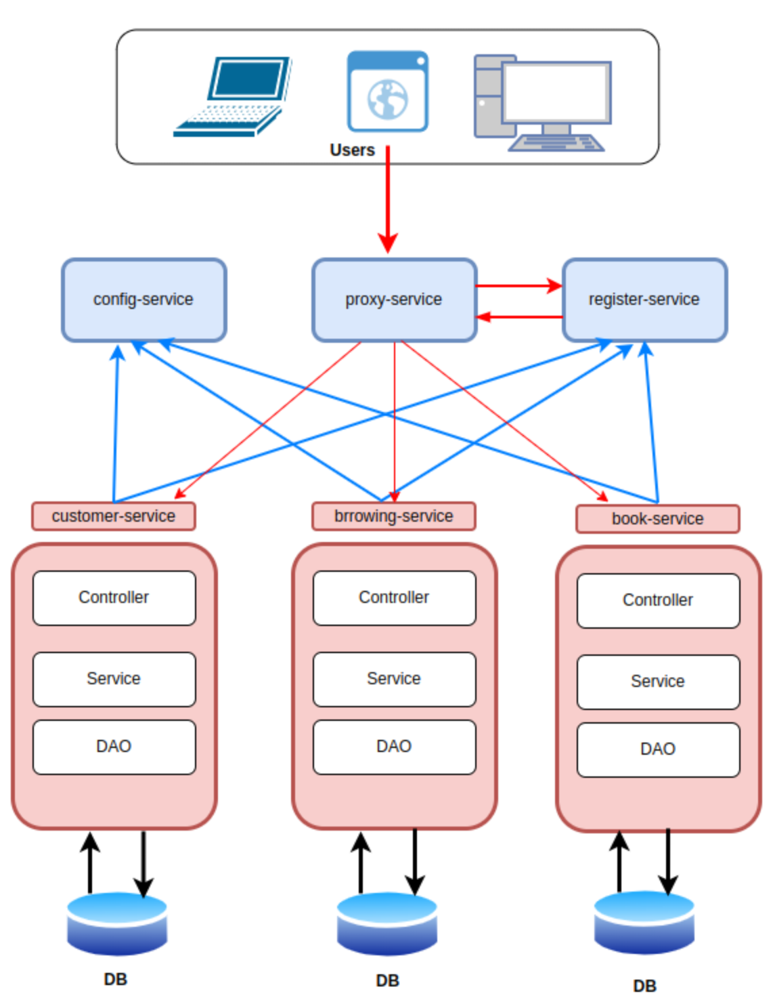
</p>
<p align="center">
Figure 1: Architecture of our application based-on microservices 
</p>

### Microservices Startup Order
We must follow a specific startup order for the microservices to ensure they are properly configured at launch and correctly registered with the discovery service.
Therefore, we start with the discovery-service, followed by the config-service.
The startup order of the following application microservices is not critical: customer-service, book-service, and borrowing-service.
Finally, we launch the gateway-service.


### How to Interact with Microservices:

-A user connects via the graphical interface or with a REST client to perform CRUD operations on our application.

-The request, which contains the name of the target microservice, first reaches the gateway microservice.

-The gateway then queries the registration management service, passing the name of the target microservice to request its IP address and port.

-The discovery-service responds to the gateway's request by sending the IP address and port of the requested microservice.

-Finally, the gateway forwards the user request to the microservice using the IP address and the port.


### Book Borrowing System - A Real Scenario

In a practical library book borrowing system, the librarian adds newly arrived books to the database each time the library receives a new shipment.
When a new customer wants to borrow books, the librarian first creates an account for the customer by calling the customer-service.
Then, the librarian creates a borrowing record by calling the borrowing-service, which interacts with both the customer-service and the book-service to establish an association between the customer and the selected books.

### Database Backup Strategy: 
We have chosen to separate the database so that each microservice has its own. This choice makes data integrity control more complex, which becomes the responsibility of the designer and must be managed at the service layers. We should note that in distributed databases, relationships between data that would traditionally be enforced by foreign keys must be handled at the application level instead.

### implementation of microservice

For simplicity, and to facilitate testing of our microservices, we insert some sample data at application startup using the _CommandLineRunner_ bean.

```#Java
@Bean
CommandLineRunner start(/*Inject needed dependencies here*/) {
    // Do some stuff here
}

```

Here is a technical description of how to implement each microservice and how to test it directly using its IP address and port.

* The customer-service :
We implement this service using a three-layer architecture: controller, service, and DAO.
The DAO layer is responsible for interacting with the database.
We create a _Customer_ entity and a DAO that extends the _JpaRepository_ interface.
The service layer handles the business logic, including data validation and integrity checks, before saving or deleting data in the database.

<p align="center">
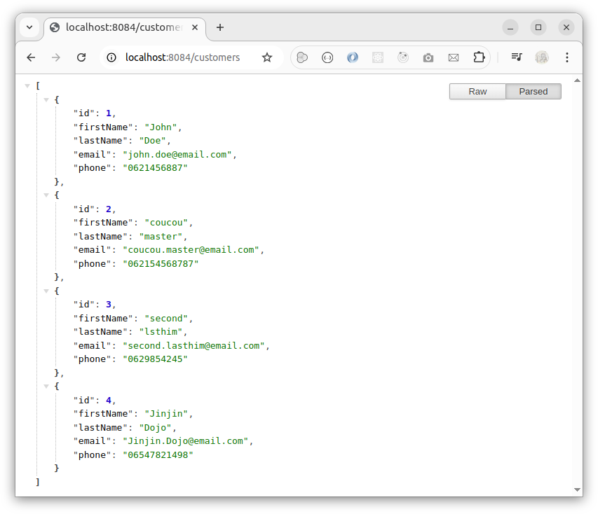
</p>
<p align="center">
Figure 2: Display the list of all saved customers 
</p>

* The book-service : 

We implement a _Book_ entity, a controller annotated with _@RestController_, a service layer, and a DAO that extends the _JpaRepository_ interface.

<p align="center">
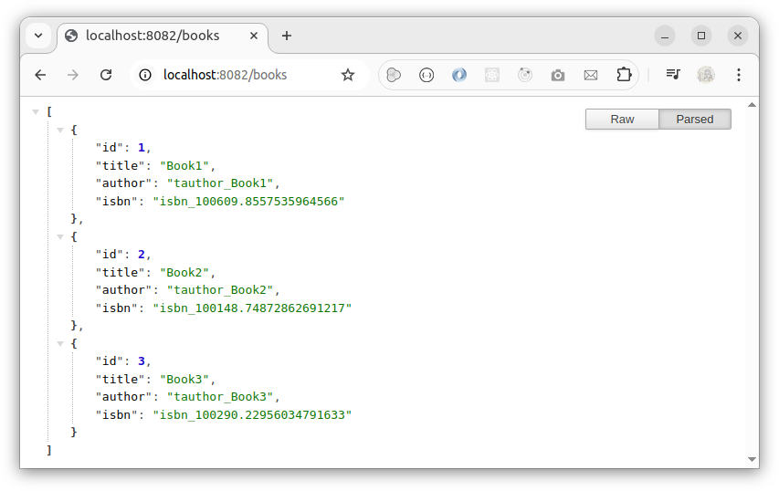
</p>
<p align="center">
Figure 3: Display the list of all saved books 
</p>

* The config-service :
It centralizes the configuration management for all microservices by allowing each microservice to load its configuration from a remote Git repository.
It is a Spring Boot application configured to point to this Git repository, where all configuration files are defined and managed.
Here is the url of the remote git repository that we use to gather all configuration files: _https://github.com/a-farsi/spring-config-repo/tree/main_

<p align="center">
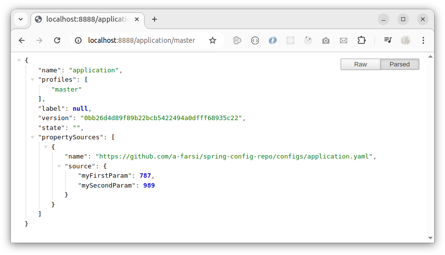
</p>
<p align="center">
Figure 4: Display the configuration in the application.yaml file  
</p>

<p align="center">
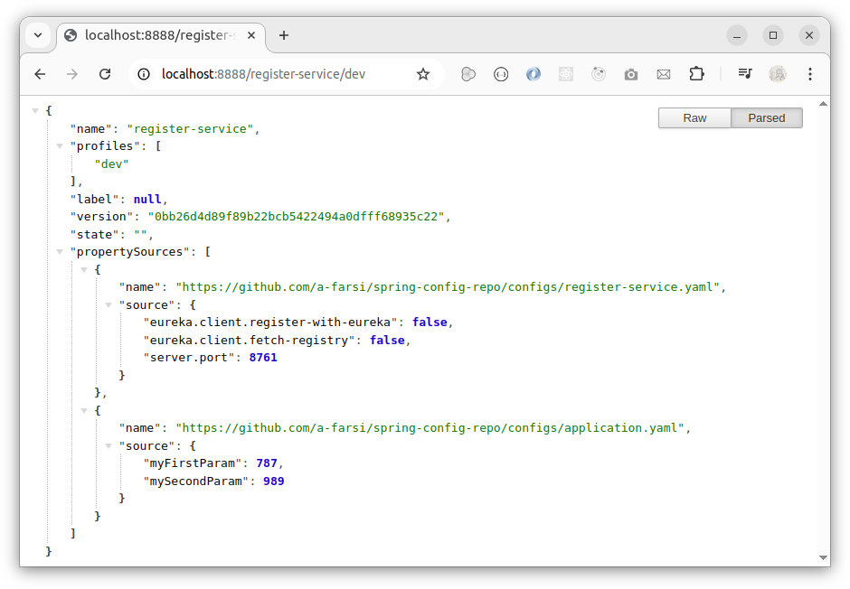
</p>
<p align="center">
Figure 5: Display the configuration in the discovery-service.yaml file  
</p>


* The discovery-service : 
we use Spring Cloud Netflix Eureka Server

<p align="center">
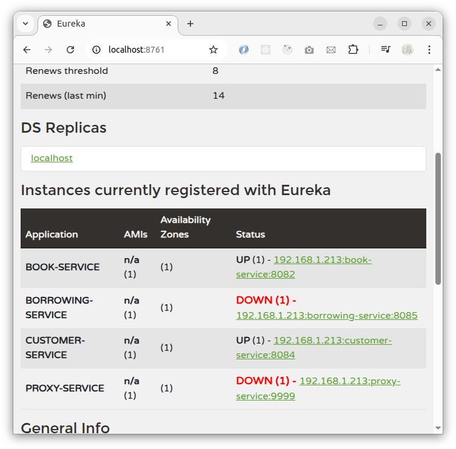
</p>
<p align="center">
Figure 6: Display the interface of the discovery-service  
</p>


* The proxy-service : 
It is a Spring Cloud Gateway

* The borrowing-service:

- A _borrow_ object can include one or multiple _borrowed books_.
- Each _borrow_ object is associated with only one _customer borrower_.
- And each borrowed book corresponds to a single _book_ item.

In this service, the entities to be persisted are the _borrow_ objects and the _borrowedbook_ objects, which we need to define as JPA entities.

The other objects, _customer_ and _book_, are already persisted in the _service-customer_ and _book_service_ respectively. 

Therefore, we will:
- Define them as DTOs with only getters and setters.
- Store the _bookID_ within the _borrowedbook_ object and the _customerID_ within the _borrow_ object. These references serve as foreign keys, useful for maintaining relationships between the tables of our application."

<p align="center">
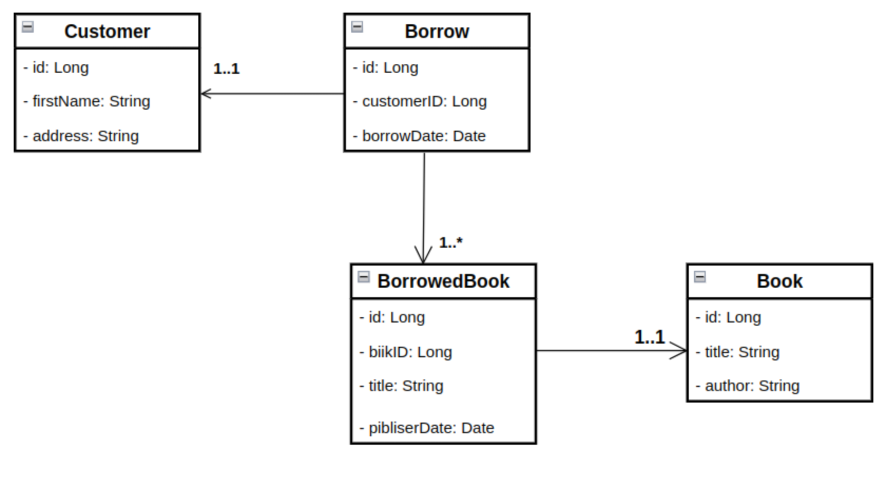
</p>
<p align="center">
Figure 7: Class diagram of the borrowing-service 
</p>


<p align="center">
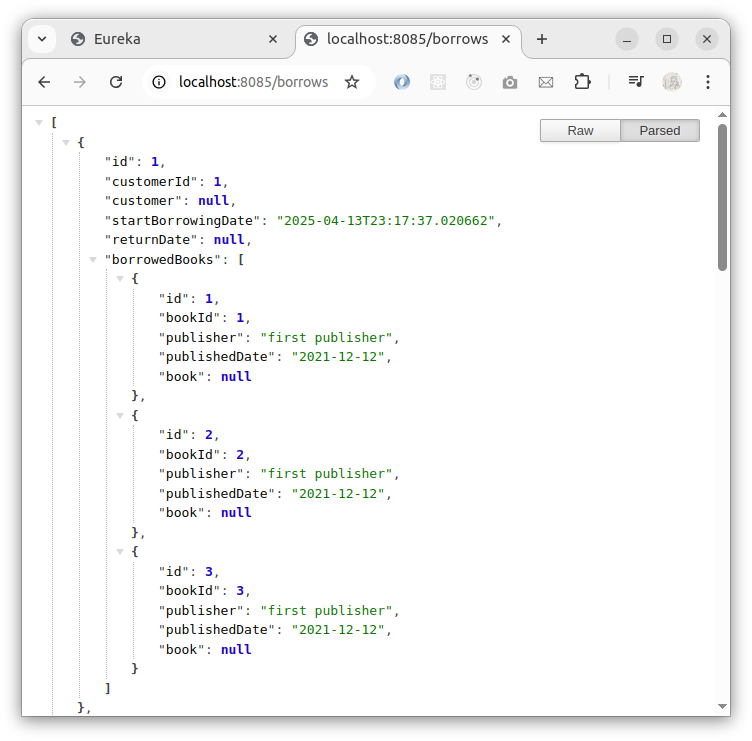
</p>
<p align="center">
Figure 8: Display all borrowing records.
</p>


The following figures show the data retrieved when accessing our microservices through the gateway.

We notice that to access a microservice via the gateway service, we need to specify the name of the targeted service. It is then the responsibility of the gateway-service and the discovery-service to route the request to the appropriate microservice.


* To access the list of books through the gateway-service 

We type : _localhost:8888/book-service/books_

<p align="center">
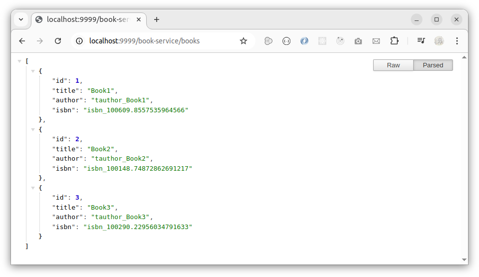
</p>
<p align="center">
Figure 9: Display the list of books when passing by the gateway-service.
</p>

* To access the list of customers through the gateway-service

We type : _localhost:8888/customer-service/customers_

<p align="center">
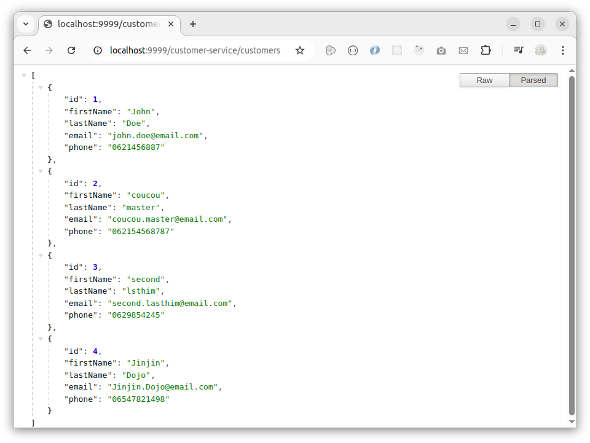
</p>
<p align="center">
Figure 10: Display the list of customers when passing by the gateway-service.
</p>

* To access the list of borrowing records through the gateway-service
We type : _localhost:8888/borrowing-service/borrows_

<p align="center">
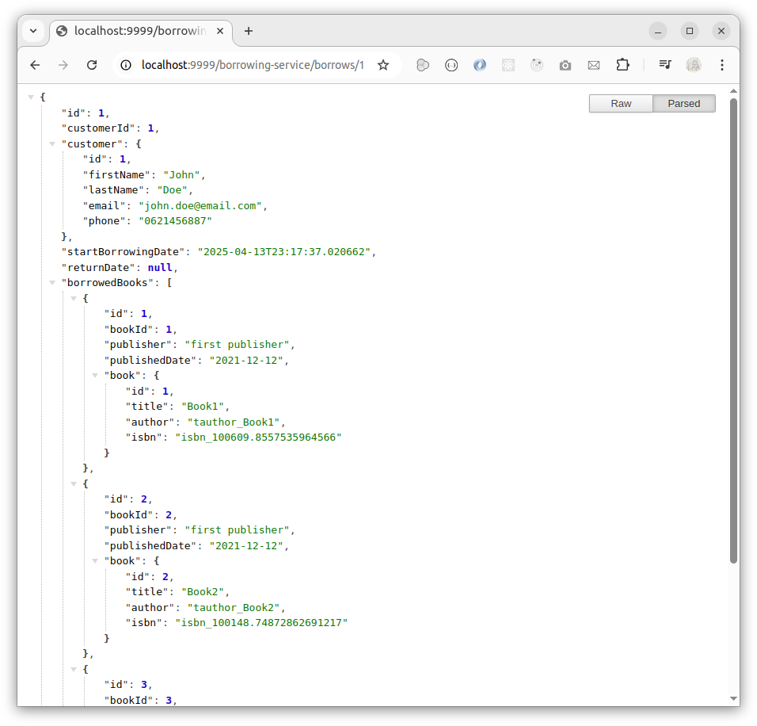
</p>
<p align="center">
Figure 11: Display the list of borrowing records when passing by the gateway-service.
</p>

